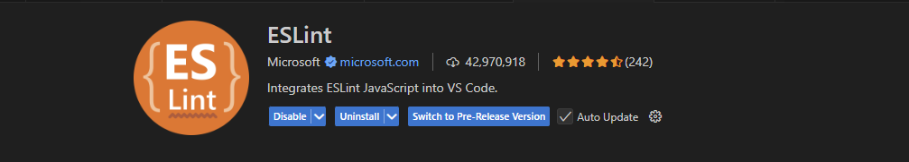
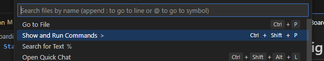

---

# 🛠️ Onboarding & Development Guide

Welcome to the team! This document covers the expected coding standards, tooling setup, workflow processes, and general practices you should follow to maintain consistency and quality across the project.

---

## ✅ Coding Standards & Linting Setup

We use **ESLint** with custom settings to ensure all JavaScript, HTML, and CSS code stays consistent across the project.

### ESLint Setup

1. Open your terminal and run:

   ```bash
   npm install
   ```

2. Install the **ESLint VSCode extension**.
   *Example Screenshot:*
   

3. Open **VSCode Commands** (Cmd/Ctrl + Shift + P) and search for:

   `
   Open User Settings (JSON)
   `

   

4. Add the following settings to your `settings.json`:

   ```json
   "editor.codeActionsOnSave": {
       "source.fixAll.eslint": "explicit"
   },
   "eslint.validate": ["javascript", "html", "css"]
   ```

5. **Restart VSCode** and confirm that auto-formatting is triggered on save.

---

## 🧩 Code Locality & Structure

We follow **Web Component Architecture** principles. This means keeping functionality, structure, and styling **close together**, but without mixing inline styles.

* Group **JavaScript**, **HTML**, and **CSS** for a component within the same folder.
* **Local state** should stay within the component or its folder when possible.
* **Event handlers** (like `onClick`) should be defined next to the markup using them.
* **No inline styles** and **no mixing** of HTML and CSS inside the same file.
* Prefer **Shadow DOM styling** to avoid polluting the global stylesheet.

---

## 🧪 Testing with Vitest

We have transitioned away from Live Server. Our workflow now uses **Vitest** for testing and **Vite** for development.

### How to Run the Local Server

* Run:

  ```bash
  npm run dev
  ```

  This will start the project locally using Vite.

### Test Requirements

* **Every web component** must have an accompanying **unit test**.

* Tests should be **co-located** with the component, named using `.test.js`.

  *Example Structure:*

  ```markdown
  /my-component/
    ├── my-component.js
    ├── my-component.test.js
    └── my-component.css
  ```

* Run tests with:

  ```bash
  npm run test
  ```

---

## 📄 JavaScript Documentation (JSDoc)

All JavaScript functions, classes, and components should include **JSDoc comments**. This provides future developers with clear context and helps auto-generate documentation.

### Example JSDoc Format

```javascript
/**
 * Calculates the sum of two numbers.
 * @param {number} a - The first number.
 * @param {number} b - The second number.
 * @returns {number} The sum of a and b.
 */
function sum(a, b) {
  return a + b;
}
```

To **generate or update the documentation**, run:

```bash
npm run docs
```

---

## 🚦 Project Scripts Overview

Look inside `package.json` for available development scripts. Here are the most commonly used:

* `npm run dev` – Runs the website locally.
* `npm run lint` – Checks for styling and linting issues.
* `npm run docs` – Generates project documentation.
* `npm run test` – Runs the Vitest test suite.

---

## 🔄 Branching & Pull Request Process

### Protected Branches

We use one protected branch:

* **`main`** – Production branch, public-facing.

> ⚠️ *You cannot push directly to these branches. All updates require pull requests.*

### Development Workflow Example
__NOTE: refer to WebComponent Guide before making any changes__
```bash
git fetch
git pull
git checkout main
git checkout -b my-feature
# make your changes
git add .
git commit -m "Describe your feature"
git push --set-upstream origin my-feature
```

* Open a pull request to **`main`** on GitHub.
* Wait for **automated checks** to pass.
* **Self-approve** and merge your own pull request.

---

## 📌 AI and Package Usage Policy

* **LLM Usage**:
  Any AI-generated code **must include explanations** for all key design decisions.
* **NPM Packages**:
  You **may not** add external packages unless you clearly **justify the necessity** and receive approval.
* **AI-Generated Code**:
  Must adhere to all styling and locality guidelines outlined above.

---

## ✅ TODO (Upcoming Additions)

*This section is reserved for any future changes or additions.*

---
