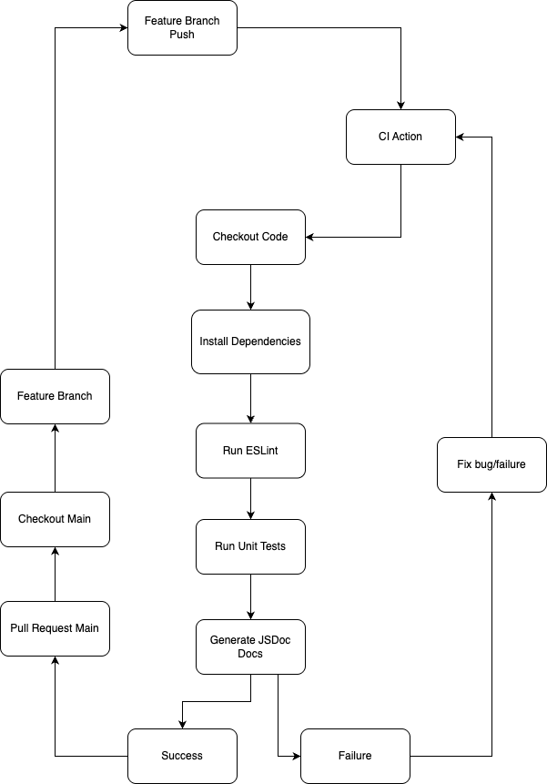

# CI Pipeline Check - Phase 1 Status

## Overview

The current Continuous Integration (CI) pipeline is fully operational and actively used on all branches for both push and pull request events. It ensures code quality and consistency through automated steps covering dependency installation, linting, testing, and documentation generation.

### Branch Protection Enforcement

This pipeline is enforced as part of our **branch protection strategy**.

* **Policy:**
  All checks **must pass** before a feature branch can be merged into **`dev`** or **main branches**.
* **Scope:**
  Applies to both:

  * Direct pushes
  * Pull requests

This prevents untested or broken code from reaching critical branches, helping us maintain higher stability and reliability across environments.

## Pipeline Triggers

* **Branches:** All branches (`'**'`)
* **Events:** `push`, `pull_request`

## Pipeline Stages

Checkout Code \
  ↓\
Setup Node.js 18\
  ↓\
Install Dependencies (npm ci)\
  ↓\
Run ESLint (default config)\
  ↓\
Run Unit Tests (component/unit)\
  ↓\
Build Documentation (incomplete onboarding docs)

### Stage Details

#### 1. Checkout Code

Uses `actions/checkout@v3` to pull the latest code from the target branch.

#### 2. Setup Node.js

Leverages `actions/setup-node@v3` to configure Node.js version `18`, ensuring a consistent runtime.

#### 3. Install Dependencies

Executes `npm ci` for clean and reproducible dependency installation.

#### 4. Run ESLint

Runs `npm run lint` using the **default ESLint configuration**.

* **Planned Improvement:**
  Future customization of ESLint rules to better match project-specific coding standards.

#### 5. Run Unit Tests

Executes `npm test`, which currently covers:

* **Component Tests**

* **Unit Tests**

* **Planned Improvement:**
  Expand test coverage to include:

  * Integration Tests
  * End-to-End (E2E) Tests
  * Performance and Security Tests

#### 6. Build Documentation

Runs `npm run docs` to generate project documentation.

* **Current Limitation:**
  Onboarding documentation remains **incomplete**, requiring additional content to fully support new contributors.

* **Planned Improvement:**
  Complete the onboarding and contribution guides to improve developer experience.

## Summary of Current and Planned State

| Feature            | Current Status             | Planned Improvements                                  |
| ------------------ | -------------------------- | ----------------------------------------------------- |
| Branch Triggers    | All branches (`'**'`)      | No changes planned                                    |
| Dependency Install | `npm ci`                   | No changes planned                                    |
| ESLint             | Default config             | Add custom project-specific rules                     |
| Tests              | Component & Unit           | Add Integration, E2E, Performance, and Security tests |
| Documentation      | Incomplete onboarding      | Expand onboarding and contribution guides             |
| Branch Protection  | Enforced on PRs and Pushes | No changes planned                                    |

## Next Steps

1. **Define and Implement Custom ESLint Rules**
2. **Expand Test Suite Coverage**
3. **Complete Documentation for Onboarding and Contribution**
4. **Evaluate Performance and Security Testing Tools**

