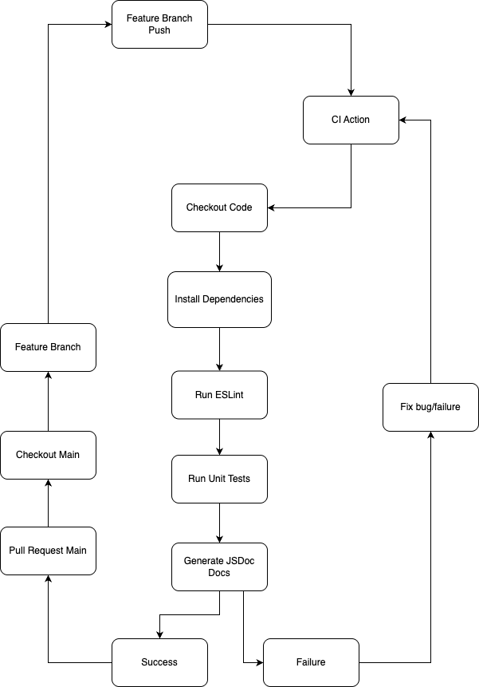

---

# CI Pipeline Check - Phase 2 Status

## Overview

Phase 2 of the CI pipeline introduces **automated build and deployment** capabilities to streamline our release process. Specifically, this phase ensures that our application is **automatically built and optimized using `vite build`**, and then **deployed to GitHub Pages** for immediate availability.

This enhancement increases deployment consistency, reduces manual effort, and ensures our production build is always up to date and optimized for performance.

---

### Branch Protection Enforcement

The existing branch protection policies from Phase 1 continue to apply in Phase 2.

* **Policy:**
  All CI checks must pass before merging into protected branches ( `main`).
* **Scope:**
  Applies to:

  * Direct pushes
  * Pull requests

This enforces code quality before automatic build and deployment steps are triggered.

---

## Pipeline Triggers

* **Branches:** All branches (`'**'`)
* **Events:** `push`, `pull_request`

> **Note:** Deployment only occurs when changes are pushed to `main`.

---

## Pipeline Stages

Checkout Code
↓
Setup Node.js 18
↓
Install Dependencies (`npm ci`)
↓
Run ESLint
↓
Run Unit Tests
↓
Build Documentation
↓
**Build Project via `vite build`**
↓
**Deploy to GitHub Pages**

---

### Stage Details

#### 1–6. 

Stages 1 through 6 remain the same (see Phase 1), covering code checkout, setup, linting, testing, and documentation generation.

#### 7. Build Project via `vite build`

Executes `npm run build`, which internally calls `vite build` to:

* Optimize and compress HTML, CSS, and JavaScript
* Minify code for faster page loads
* Generate a clean `dist/` directory for static site deployment

- **Benefits:**

  * Faster load times
  * Smaller bundle sizes
  * Production-ready output

#### 8. Deploy to GitHub Pages

Automatically deploys the contents of the `dist/` folder to GitHub Pages using a dedicated GitHub Action.

* **Target Branch:** `gh-pages`

* **Deployment Trigger:** Push to `main`

* **Planned Improvement:**
  Add deployment previews for feature branches and PRs in the future.

---

## Summary of Current and Planned State

| Feature           | Current Status                    | Planned Improvements                         |
| ----------------- | --------------------------------- | -------------------------------------------- |
| Build Process     | `vite build` on main              | None                                         |
| Deployment        | Auto-deploy to GitHub Pages       | Add preview deployments for PRs              |
| Optimization      | HTML/CSS/JS minification via Vite | None                                         |
| Release Strategy  | Auto-deploy on main branch push   | Add release tagging and changelog generation |
| Branch Protection | Enforced (push & PR)              | No changes planned                           |

---

## Next Steps

1. **Add Preview Deployments for PRs**
2. **Integrate Release Tagging and Changelog Automation**
3. **Monitor Build Size and Performance Over Time**
4. **Explore Caching for Faster Build Times**

---
